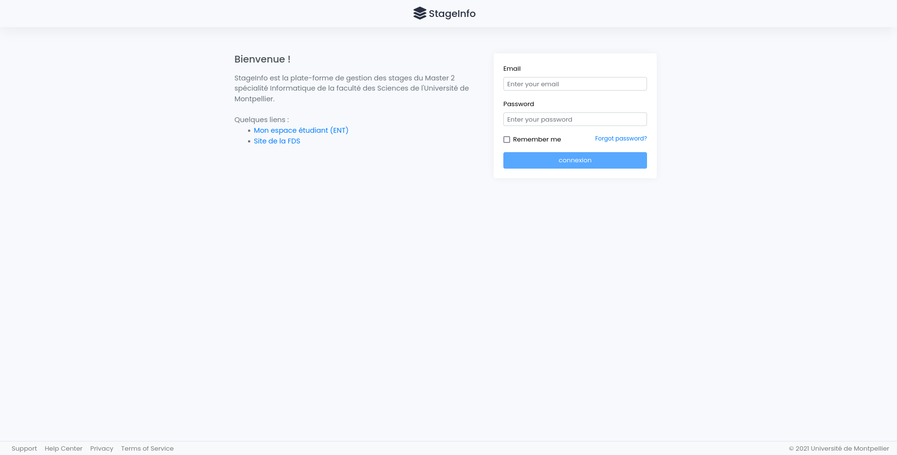
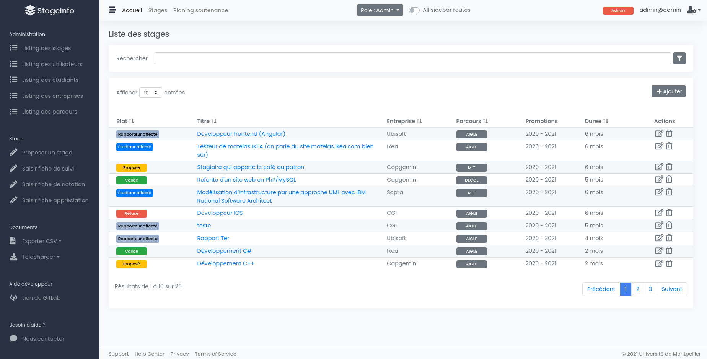

# StageInfo

## Screenshots

  
   

## Description
L'objectif du projet est de réaliser une plateforme de gestion de stage pour les étudiants de Master informatique de la Faculté des Sciences de Montpellier.

## Manuel d'installation

Pour installer la plateforme de gestion de stage sur une machine locale, veuillez respecter les étapes suivantes : 

### Etape 1 : Lancement du server (backend)

- Téléchargement de NodeJS : `https://nodejs.dev/`
- Installation des modules : `npm install`
- Lancement du serveur : `node server.js`

### Etape 2 : Lancement du (frontend)

- Télécharger Angular : `https://angular.io/`
- Installation des modules : `npm install`
- Lancement de l'application Angular : `ng serve`
